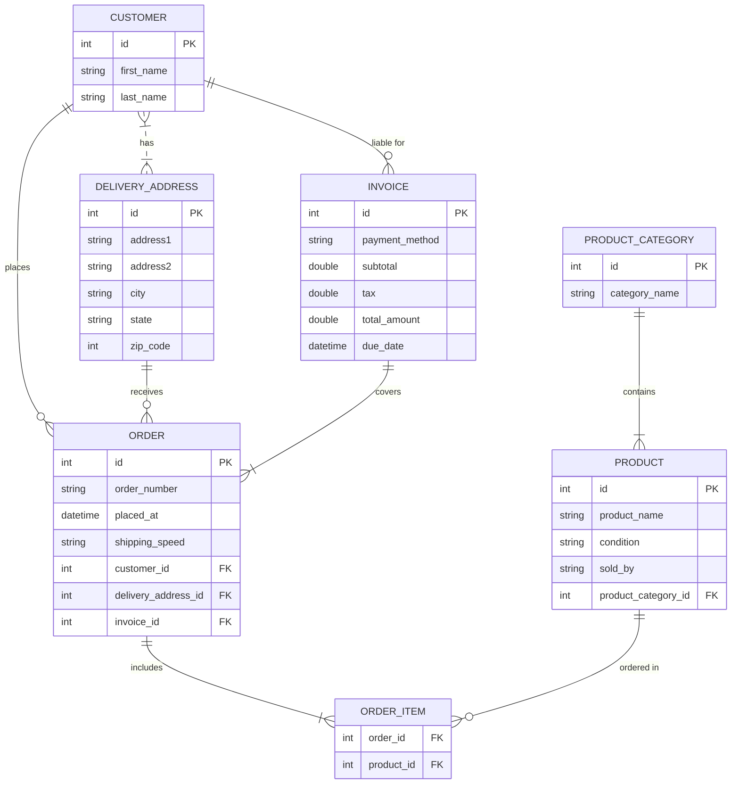

# Database Entities

```mermaid
erDiagram
    CUSTOMER }|..|{ DELIVERY_ADDRESS : has
    CUSTOMER ||--o{ ORDER : places
    CUSTOMER ||--o{ INVOICE : "liable for"
    CUSTOMER {
        int id PK
        string first_name
        string last_name
    }
    DELIVERY_ADDRESS ||--o{ ORDER : receives
    DELIVERY_ADDRESS {
        int id PK
        string address1
        string address2
        string city
        string state
        int zip_code
    }
    INVOICE ||--|{ ORDER : covers
    INVOICE {
        int id PK
        string payment_method
        double subtotal
        double tax
        double total_amount
        datetime due_date
    }
    ORDER ||--|{ ORDER_ITEM : includes
    ORDER {
        int id PK
        string order_number
        datetime placed_at
        string shipping_speed
        int customer_id FK
        int delivery_address_id FK
        int invoice_id FK
    }
    PRODUCT_CATEGORY ||--|{ PRODUCT : contains
    PRODUCT_CATEGORY {
        int id PK
        string category_name
    }
    PRODUCT ||--o{ ORDER_ITEM : "ordered in"
    PRODUCT {
        int id PK
        string product_name
        string condition
        string sold_by
        int product_category_id FK
    }
    ORDER_ITEM {
        int order_id FK
        int product_id FK
    }
```
